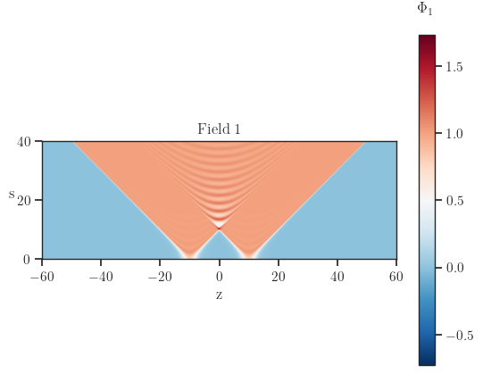
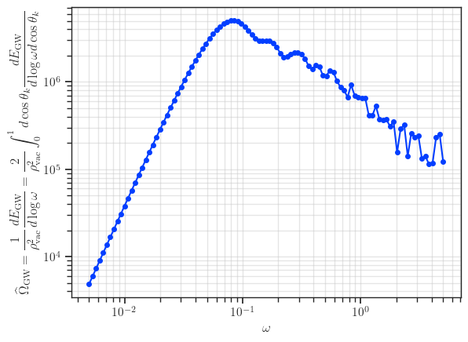

# gw_fopt
**gw_fopt** is a high-performance Python package with Rust bindings, designed to compute the gravitational wave (GW) spectrum arising from bubbles collisions in first order phase transition.
Currently, this is a workspace containing two different packages: **bubble_dynamics** and **bubble_gw**, each taking care of different computational aspects
+ **bubble_dynamics** is a Python library that mainly solves the equation of motion of two bubbles system in $(1+1)D$ spacetime (instead of the full $(3+1)D$ equation of motion, thanks to the $O(2,1)$ symmetry of this system). This package also includes tools to extract the surface tension of the wall before and after collision, which is later used in fitting to extract coefficients for the generalized bulk-flow method in computing the GW spectrum.

+ **bubble_gw** leveraging Rust for improved computational efficiency and PyO3 for generating a Python interface. This package computes the GW spectrum via different modules:

  + **bubble_gw.two_bubbles** compute the exact GW spectrum of two bubbles system by taking the input of fields evolution on the $(1+1)D$ lattice computed from **bubbles_dynamics** and numerically compute the GW spectrum via  the fourier transformed stress-energy tensor.
The core computation of exact two bubbles spectrum is a reimplementation of the [two_bubbles_code-v1.0.1](https://zenodo.org/records/5127538.).

  + **bubble_gw.many_bubbles** compute the approximate GW spectrum via the generalized bulk-flow, with the input are lattice sizes and the bubble configuration of an arbitrary number of bubbles.

## Installation

**gw_fopt** requires the Rust toolchain to be installed on your system.
The simplest way to install **gw_fopt** is via the **uv**, a Python package and project manager

1. Ensure you have the Rust toolchain installed

  ```bash
  curl --proto '=https' --tlsv1.2 -sSf https://sh.rustup.rs | sh
  ```

2. Install **uv**

  ```bash
  curl -LsSf https://astral.sh/uv/install.sh | sh
  ```

3. Build and install **gw_fopt**: from the workspace directory run

  ```bash
  uv sync
  ```

  This command creates an virtual environment in .venv, install the necessary packages, compile and install the Rust code in release mode.
In order to use the installed packages, you need to source the virtual environment corresponding to your shell, for example if you use `bash`, from the workspace directory run
  ```bash
  source .venv/bin/activate
  ```

## Examples of using the package **gw_fopt**

+ [two bubbles](./docs/two_bubbles.md): Here we use `bubbles_dynamics` to solve the equation of motion on $(1+1)D$ lattice of a quartic potential and plugging this to `bubbles_gw.two_bubbles` to compute the exact GW spectrum.
Also from the field evolution, we can compute the surface tension of the wall as a function of time, which will be useful in fitting and extracting the coefficients for the generalized bulk-flow approximation.

| Field evolution | Corresponding GW spectrum |
|-|-|
|| |

+ [generalized bulk-flow](./docs/generalized_bulkflow.md): Here we illustrate how to approximate the GW spectrum using generalized bulk-flow scheme, with the input being the bubbles configuration (i.e a list of four-vectors $(t_c, x_c, y_c, z_c)$ of the center of the nucleated bubbles).

| First collided bubbles | Collision time with first collided bubbles |
|-|-|
| | |

## Some docs for useful utilities

+ [sample](./docs/sample.md): This util can be used to generate the samples for the parameter scan.
It is especially useful when working with an expensive (i.e time consuming) function, where we can divide the input parameters into several disjoint batches with gradually larger density.
One then get the output of the expensive function with higher and higher resolution over the whole range of parameter scan per iteration.
This helps to avoid the case where we start with too many parameters and have to wait for a long time to get all the data in one batch, and risk loosing the output in the whole range of parameters if the computation suddenly stopped (e.g we have an input where the scan function throw an error and stop running in the middle of the long parameter scan.)

| Uniform sampling | Log sampling |
|-|-|
| | |