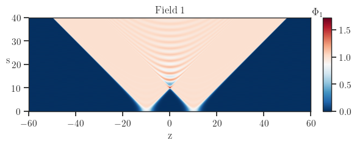
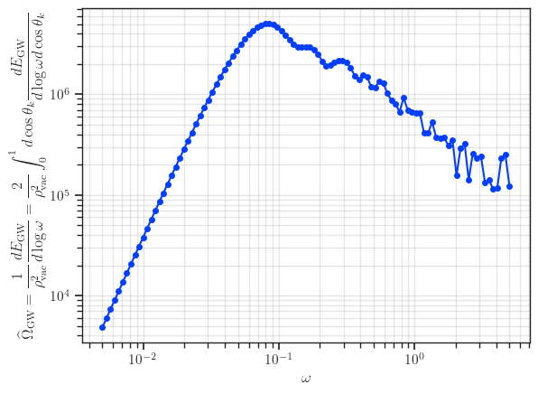
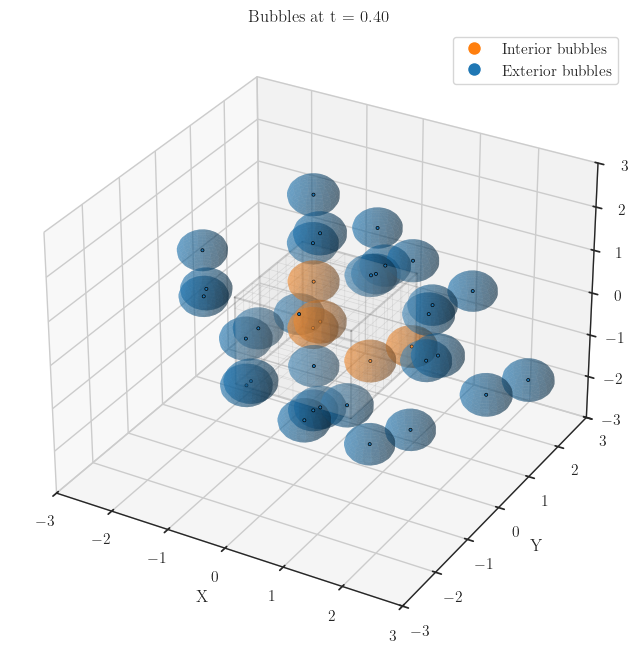
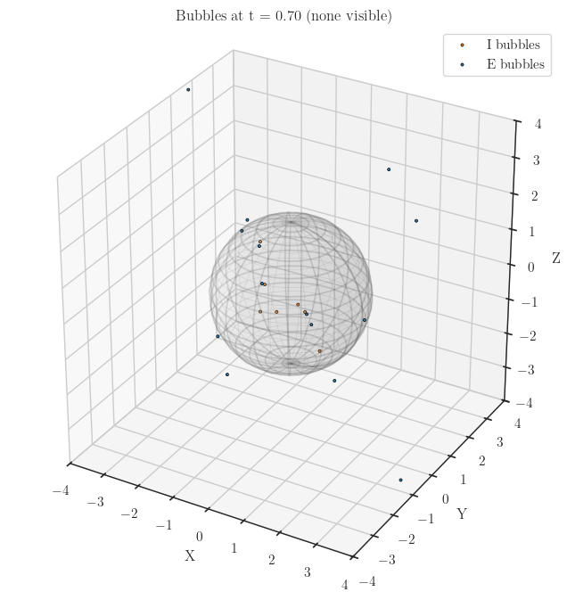
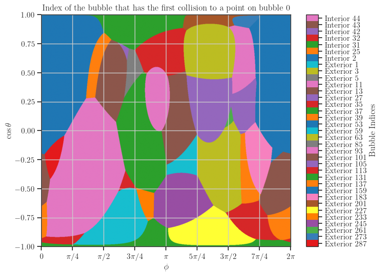
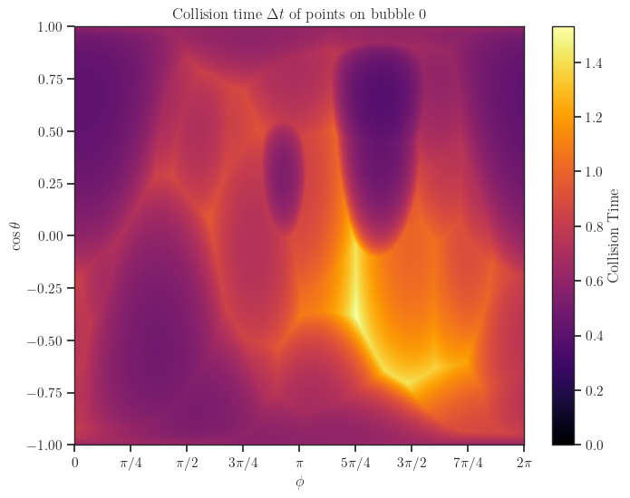
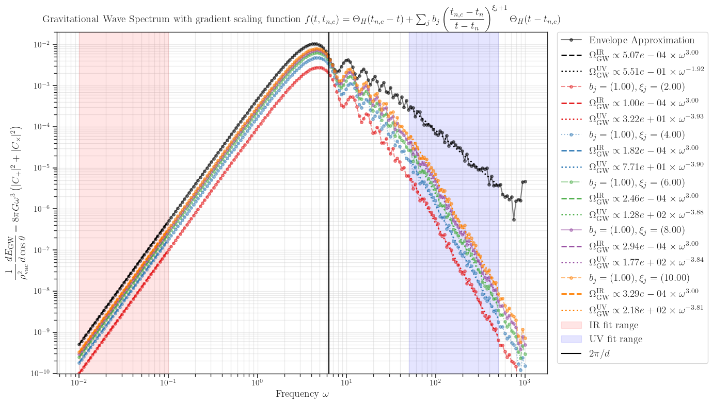
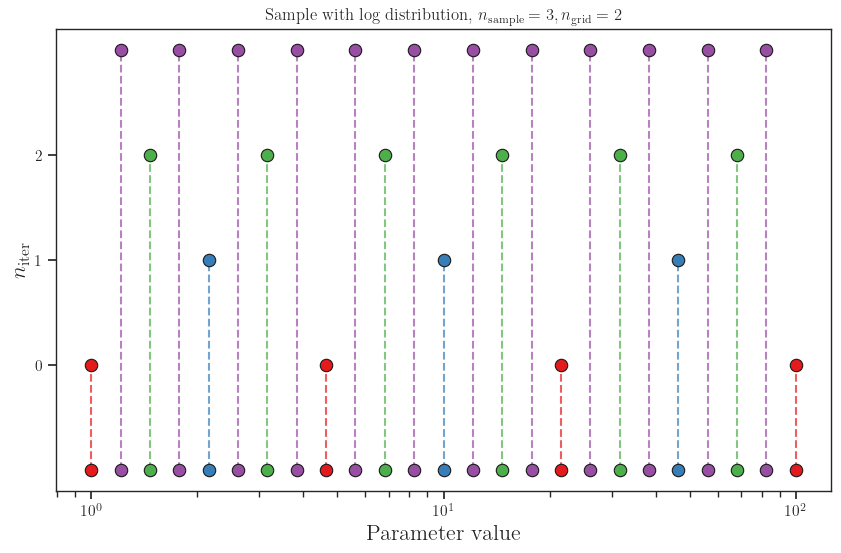

# gw_fopt

**gw_fopt** is a mixed Python/Rust scientific package for computing gravitational-wave (GW) spectra sourced by bubble collisions in first-order phase transitions.
The project can be used from three language interfaces:

+ **Rust**: the native computational crate `bubble_gw`.
+ **Python**: the main user-facing interface, installed with `uv sync`.
+ **C/C++**: an opt-in C ABI crate that exposes selected `bubble_gw` functionality through a generated header.

At the Python package level, the workspace contains two main namespaces: **bubble_dynamics** and **bubble_gw**, each taking care of different computational aspects.

+ **bubble_dynamics** is a Python library that mainly solves the equation of motion of two bubbles system in $(1+1)D$ spacetime (instead of the full $(3+1)D$ equation of motion, thanks to the $O(2,1)$ symmetry of this system). This package also includes tools to extract the surface tension of the wall before and after collision, which is later used in fitting to extract coefficients for the generalized bulk-flow method in computing the GW spectrum.

+ **bubble_gw** leverages Rust for improved computational efficiency and PyO3 for generating a Python interface. This package computes the GW spectrum via different modules:

  + **bubble_gw.two_bubbles** compute the exact GW spectrum of two bubbles system by taking the input of fields evolution on the $(1+1)D$ lattice computed from **bubbles_dynamics** and numerically compute the GW spectrum via  the fourier transformed stress-energy tensor.
The core computation of exact two bubbles spectrum is a reimplementation of the [two_bubbles_code-v1.0.1](https://zenodo.org/records/5127538.).

  + **bubble_gw.many_bubbles** compute the approximate GW spectrum via the generalized bulk-flow, with the input are lattice sizes and the bubble configuration of an arbitrary number of bubbles.

## Common Prerequisite

All three usage paths require the Rust toolchain to be installed on your system.
Install Rust first if it is not already available:

```bash
curl --proto '=https' --tlsv1.2 -sSf https://sh.rustup.rs | sh
```

## Use From Rust

The native Rust crate lives in `rust/bubble-gw` and is part of the Rust workspace.
Use it directly when writing Rust code or when benchmarking/debugging the numerical core without Python or C ABI layers.

From `rust/`:

```bash
cargo build -p bubble_gw --release
cargo test -p bubble_gw
```

The Rust crate provides the core modules:

+ `bubble_gw::two_bubbles`: exact two-bubble GW calculations from sampled field evolution.
+ `bubble_gw::many_bubbles`: lattice bubbles, nucleation utilities, and generalized bulk-flow calculations.

## Use From Python

The simplest way to install **gw_fopt** for Python use is via **uv**, a Python package and project manager.

1. Install **uv**

  ```bash
  curl -LsSf https://astral.sh/uv/install.sh | sh
  ```

1. Build and install the Python package: from the workspace directory run

  ```bash
  uv sync
  ```

  This command creates a virtual environment in `.venv`, installs the Python dependencies, and builds the PyO3 extension from `rust/py-bubble-gw`.
In order to use the installed packages, you need to source the virtual environment corresponding to your shell, for example if you use `bash`, from the workspace directory run

  ```bash
  source .venv/bin/activate
  ```

## Use From C/C++

The C/C++ interface is provided by the separate crate `rust/c-bubble-gw`.
It exposes a C ABI over selected `bubble_gw` functionality and commits the generated header at `rust/c-bubble-gw/include/bubble_gw.h`.
This interface is highly experimental and may not work as expected; prefer the Rust or Python APIs unless you specifically need C/C++ integration.
This path is independent from the Python `uv sync` workflow.

From `rust/`:

```bash
cargo build -p c-bubble-gw --release
```

This produces linkable libraries under `rust/target/release/`.
C and C++ callers should include:

```c
#include "bubble_gw.h"
```

Regenerate the header with `cbindgen` after changing exported C ABI types or functions:

```bash
cbindgen --config c-bubble-gw/cbindgen.toml \
  --crate c-bubble-gw \
  --lang c \
  --output c-bubble-gw/include/bubble_gw.h
```

The C ABI uses opaque handles, caller-owned row-major arrays, explicit dimensions, and `BgwStatus` return codes.
Use `bgw_last_error_message()` to inspect the latest failure message.

## Build and open the local documentation

The user guide is built with Zensical and includes the narrative Markdown pages and Python API pages.
Rust API documentation is generated separately with `cargo doc`.

1. Install the documentation dependencies:

  ```bash
  uv sync --extra docs
  ```

1. Build the Zensical site only:

  ```bash
  uv run zensical build
  ```

1. Optionally build Rust API docs and copy them into the generated site so the Rust API link works:

  ```bash
  cd rust
  cargo doc -p bubble_gw --no-deps
  cd ..
  rm -rf site/rustdoc
  mkdir -p site/rustdoc
  cp -R rust/target/doc/. site/rustdoc/
  ```

1. Open a live local preview:

  ```bash
  uv run zensical serve
  ```

  Then visit the local URL printed by Zensical, usually <http://localhost:8000/>.

## Examples of using the package **gw_fopt**

+ [two bubbles](./docs/two_bubbles.md): Here we use `bubbles_dynamics` to solve the equation of motion on $(1+1)D$ lattice of a quartic potential and plugging this to `bubbles_gw.two_bubbles` to compute the exact GW spectrum.
Also from the field evolution, we can compute the surface tension of the wall as a function of time, which will be useful in fitting and extracting the coefficients for the generalized bulk-flow approximation.

| Field evolution                                                           | Corresponding GW spectrum                                         |
| ------------------------------------------------------------------------- | ----------------------------------------------------------------- |
|  |  |

+ [lattice bubbles](./docs/lattice_bubbles.md): Here we show how to define a lattice (Cartesian or Spherical), attach the bubbles into a lattice and generate the exterior bubbles via boundary conditions (currently support "periodic" and "reflection" boundary conditions).
One can also define an Isometry3 transformation (i.e spatial translation + rotation) and apply to the whole lattice+bubbles system.

| Bubbles in a cartesian lattice with periodic boundary condition                            | Bubbles in a spherical lattice with reflection boundary condition                                |
| ------------------------------------------------------------------------------------------ | ------------------------------------------------------------------------------------------------ |
|  |  |

+ [generalized bulk-flow](./docs/generalized_bulkflow.md): Here we illustrate how to approximate the GW spectrum using generalized bulk-flow scheme, with the input being the bubbles configuration (i.e a list of four-vectors $(t_c, x_c, y_c, z_c)$ of the center of the nucleated bubbles).

| First collided bubbles                                                            | Collision time with first collided bubbles                               |
| --------------------------------------------------------------------------------- | ------------------------------------------------------------------------ |
|  |  |

Generalized bulk-flow with various $\xi$-powers for two bubbles system with no boundary conditions


## Some docs for useful utilities

+ [sample](./docs/sample.md): This util can be used to generate the samples for the parameter scan.
It is especially useful when working with an expensive (i.e time consuming) function, where we can divide the input parameters into several disjoint batches with gradually larger density.
One then get the output of the expensive function with higher and higher resolution over the whole range of parameter scan per iteration.
This helps to avoid the case where we start with too many parameters and have to wait for a long time to get all the data in one batch, and risk loosing the output in the whole range of parameters if the computation suddenly stopped (e.g we have an input where the scan function throw an error and stop running in the middle of the long parameter scan.)

| Uniform sampling                                     | Log sampling                                 |
| ---------------------------------------------------- | -------------------------------------------- |
|  |  |

## Roadmap and status

State key:

+ 🟢 - fully implemented
+ 🟡 - partially implemented
+ 🟠 - implemented, but partially broken
+ 🔴 - not yet implemented

| Feature                                                                                                                                       | Status |
| :-------------------------------------------------------------------------------------------------------------------------------------------- | :----: |
| **# bubble_dynamics**                                                                                                                         |        |
| Evolution of two-bubbles on lattice using leapfrog                                                                                            |   🟢    |
| Evolution of two-bubbles on lattice using adaptive mesh refinement?                                                                           |   🔴    |
| Extract the surface tension along the bubble wall                                                                                             |   🟢    |
| **# bubble_gw**                                                                                                                               |        |
| Compute GW spectrum of two-bubble collision with input from $(1+1)D$ lattice simulation                                                       |   🟢    |
| Support for common Lattices (parallelepiped, cartesian, spherical) where we attach/generate Bubbles                                           |   🟢    |
| Support LatticeBubbles: a bundle of bubbles and lattice to perform checks on bubbles inside/outside lattice and bubbles formed inside bubbles |   🟢    |
| Implement core computations of generalized bulk-flow along $z$ direction                                                                      |   🟢    |
| Generate bubbles with given nucleation rate $\beta$                                                                                           |   🟠    |
| Generalized bulk-flow computations along arbitrary $\hat{\mathbf{k}}$ directions without rotating the input Bubbles?                          |   🔴    |

> [!NOTE]
> From personal experience in using bubble_gw from Python code, it could happen that the the Python kernel died while executing the Rust code.
> This is because Rust library faced an unrecoverable error (e.g out of bounds memory access) and panic instead of throwing error to be handled by the user.
> We tried to handle extensively these edge cases whenever we encounter them.
> If you face such a situation, please open an issue.

<!-- Additional details for each step in the roadmap below: -->

## License

Licensed under either of

+ MIT license ([LICENSE-MIT](./LICENSE-MIT))

+ Apache License, Version 2.0 ([LICENSE-APACHE](./LICENSE-APACHE))
