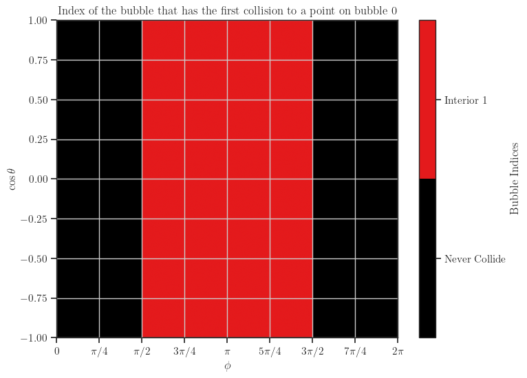
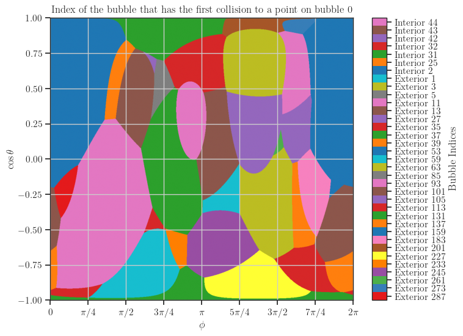
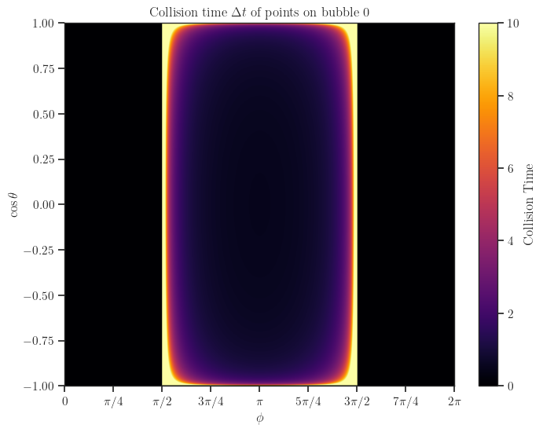
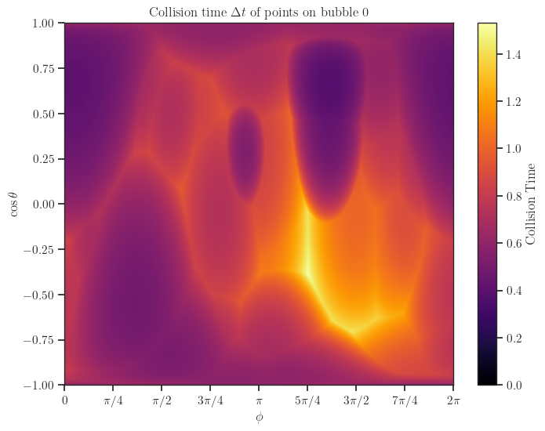
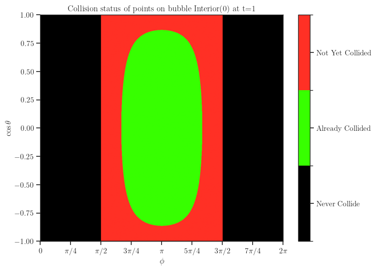
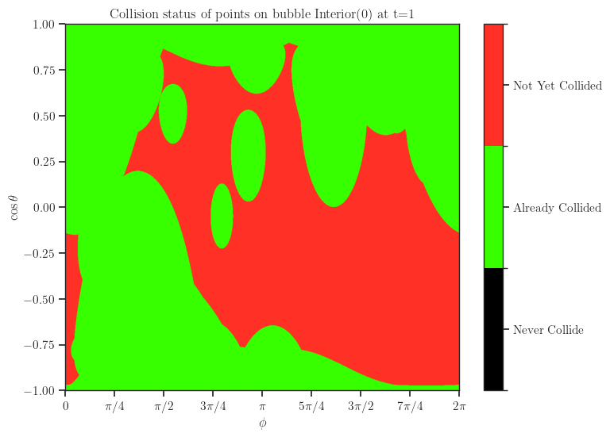
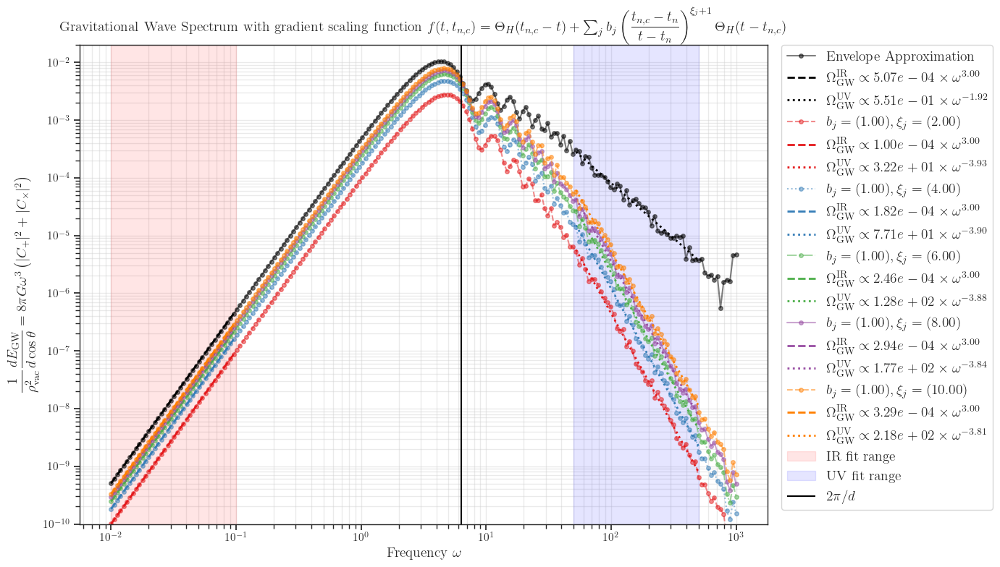

# Generalized bulk-flow approximations

## Physics Background

Consider the gravitational waves (GW) background sourced by bubble collisions during First Order Phase Transition (FOPT).
The GW energy radiated along the $\hat{\textbf{z}}$ direction is

```math
\begin{align}
\frac{d E_{GW}}{d \omega d \Omega}
    &= 2 G \omega^2 \Lambda_{ij,lm}(\hat{\bm{k}}) \widetilde{T}^{*}_{ij}(\hat{\bm{k}},\omega) \widetilde{T}_{lm}(\hat{\bm{k}},\omega) \nonumber \\
    &= 2 G \omega^2 \left( \mathrm{Tr}\left[ P_{\hat{\bm{k}}} \widetilde{T}^\ast_{} P_{\hat{\bm{k}}} \widetilde{T} \right] - \dfrac{1}{2} \left\vert \mathrm{Tr}\left[ P_{\hat{\bm{k}}} \widetilde{T} \right] \right\vert^2 \right),
\end{align}
```

where

```math
\begin{align*}
    \Lambda_{ij,lm}(\hat{\bm{k}}) &= P_{\hat{\bm{k}}}^{il} P_{\hat{\bm{k}}}^{jm} - \dfrac{1}{2} P_{\hat{\bm{k}}}^{ij} P_{\hat{\bm{k}}}^{lm}, \qquad P_{\hat{\bm{k}}}^{ij} = \delta_{ij} - \hat{\bm{k}}_i \hat{\bm{k}}_j \\
    T_{ij}(\hat{\bm{k}},\omega) &=\frac{1}{2\pi}\int dt \, d^3x \, e^{i\omega(t-\hat{\bm{k}} \cdot \bm{x})}T_{ij}(\bm{x},t)
    = \kappa \rho_\text{vac} v_b^3 C_{ij} (\hat{\bm{k}},\omega), \\
    C_{ij}(\hat{\bm{k}},\omega) &= \dfrac{1}{6 \pi} \sum_n \int dt \, e^{i \omega (t - \hat{\bm{k}} \cdot \bm{x}_n)} A_{n, ij}(\hat{\bm{k}},\omega), \\
    A_{n, ij}(\hat{\bm{k}},\omega) &= \int_{S_n} d \Omega_x \, e^{-i \omega v_b (t - t_n) \hat{\bm{k}} \cdot \bm{\hat{x}}} \hat{\bm{x}}_i \hat{\bm{x}}_j \left[ (t - t_n)^3  f(t,t_{n,c})\right]
\end{align*}
```

Where

+ $t_{n,c}(\zeta, \phi)$ denotes the time at which the wall element of the $n$-th bubble undergoes a the first collision with other bubbles.
+ $X_{ij} \equiv \hat{\bm{x}}_i \hat{\bm{x}}_j$ in spherical coordinates reads

    ```math
    X = \begin{pmatrix}
    \sin^2 \theta_x \cos^2 \phi_x & \sin^2 \theta_x \sin \phi_x \cos \phi_x & \sin \theta_x \cos \theta_x \cos \phi_x \\
    \sin^2 \theta_x \sin \phi_x \cos \phi_x & \sin^2 \theta_x \sin^2 \phi_x & \sin \theta_x \cos \theta_x \sin \phi_x \\
    \sin \theta_x \cos \theta_x \cos \phi_x & \sin \theta_x \cos \theta_x \sin \phi_x & \sin^2 \theta_x
    \end{pmatrix}
    ```

+ $f(t, t_n, t_{n, c})$ is the scaling function can be decomposed into the envelope contribution (i.e before first collision) and generalized bulk-flow contribution (i.e after first collision) as follows

    ```math
        f_\sigma(t, t_n, t_{n, c}) \equiv
        \Theta(t_{n, c}-t)
        + \Theta(t - t_{n, c}) \left(\frac{t_{n, c}-t_n}{t-t_n}\right)^3 \sum_\xi a_\xi \left(\frac{t_{n, c}-t_n}{t-t_n}\right)^\xi,
    ```

    where the coefficients $a_\xi$ can be extracted from fitting the surface tension of the bubble wall from e.g $(1+1)D$ simulation using package **bubble_dynamics**

    ```math
        \sigma(t,t_n, t_{n, c}) = \Theta(t_{n, c}-t)\sigma_0 (t-t_n)
        + \Theta(t - t_{n, c}) \sigma_0 (t_{n, c} - t_n) \left(\frac{t_{n, c}-t_n}{t-t_n}\right)^2 \sum_\xi a_\xi \left(\frac{t_{n, c}-t_n}{t-t_n}\right)^\xi,
    ```

With the choice $\hat{\bm{k}} = (0, 0, 1)$, the computations are simplified to

```math
\begin{align}
    \frac{d E_{GW}}{d \omega d \Omega_x}
    &=  G \omega^2 \left(\left\vert \widetilde{T}_{xx} - \widetilde{T}_{yy}\right\vert^2+2 \left\vert \widetilde{T}_{xy} \right\vert^2 + 2 \left\vert\widetilde{T}_{yx} \right\vert^2 \right) \nonumber \\
    &= 4 G \rho_\text{vac}^2 \omega^2 \left( \vert C_+ \vert^2 + \vert C_- \vert^2 \right), \\
    C_\pm(\omega) &= \dfrac{1}{6 \pi} \sum_{n=1}^N \int dt \ e^{i \omega (t - z_n)} A_{n, \pm}(\omega, t), \\
    A_{n, \pm}(\omega, t) &= \int_{-1}^1 d \cos \theta_x \ e^{-i \omega (t - t_n) \cos \theta_x} B_{n, \pm} (\cos \theta_x, t), \\
    B_{n, \pm}(\cos \theta_x, t) &= \dfrac{\sin^2 \theta_x}{2} \int_0^{2 \pi} d \phi_x \ X_\pm(\phi_x) \left[ (t - t_n)^3  f(t,t_{n,c})\right]
\end{align}
```

In the final line, we define $X_+ \equiv \cos 2\phi_x$, $X_- \equiv \sin 2\phi_x$.
Here, $z_n$ and $t_n$ denote the $z$-coordinate and the nucleation time of the $n$-th bubble, respectively.

## Example of computing GW spectrum in many bubbles set-up

The bubble configuration file is given at [input configuration](./examples/inputs/confY.txt), which is a table containing four columns corresponding to $(t_c, x_c, y_c, z_c)$ of the nucleated bubbles, and each row corresponds to one bubble.
The example code to reproduce the results below is [generalized_bulkflow.ipynb](./examples/generalized_bulkflow.ipynb).

### First collided bubbles

Below is the colormap which indicates the first collision between the points on the reference bubble (here denoted as bubble 0) versus other bubbles.
Here we use "Interior" to indicate the bubbles inside the lattice, and "Exterior" to call those outside the lattice, which typically generated using e.g periodic or reflection boundary conditions.
For all plots generated below, we use no boundary conditions for the case "Two bubbles" and periodic boundary condition for the case "Many bubbles".

| Two bubbles                                                                               | Many bubbles                                                                                |
| ----------------------------------------------------------------------------------------- | ------------------------------------------------------------------------------------------- |
|  |  |

### Collision time with first collided bubbles

Below we plot the quantity $t_{n,c}(\phi, \cos \theta)$, which is the moment of the first collision between the point on the reference bubble with coordinates $(\phi, \cos \theta)$ and other bubbles.
In the case "Two bubbles", since there are no exterior bubbles, the interior bubbles always have a part that never collide with the other bubble, hence we have to manually cut the maximum time at $t=10$ to plot on the colorbar.
This is not the case in "Many bubbles" where we put the periodic boundary conditions and hence introduced a natural time cut-off in the plot.

| Two bubbles                                                                      | Many bubbles                                                                       |
| -------------------------------------------------------------------------------- | ---------------------------------------------------------------------------------- |
|  |  |

### Collision status at a fixed time

| Two bubbles                                                                          | Many bubbles                                                                           |
| ------------------------------------------------------------------------------------ | -------------------------------------------------------------------------------------- |
|  |  |

### GW spectrum via generalized bulk-flow with various powers for two bubbles

In the following plot, $t_\text{end} = 0.8 d$.

