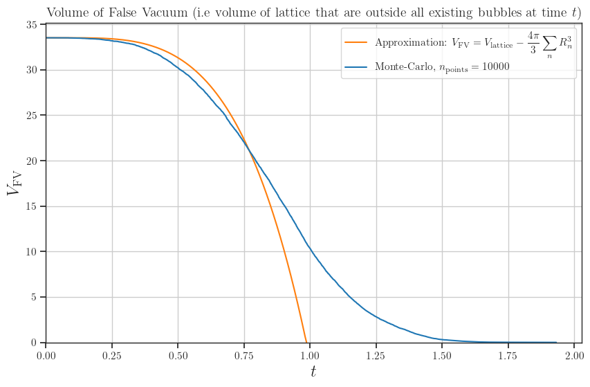
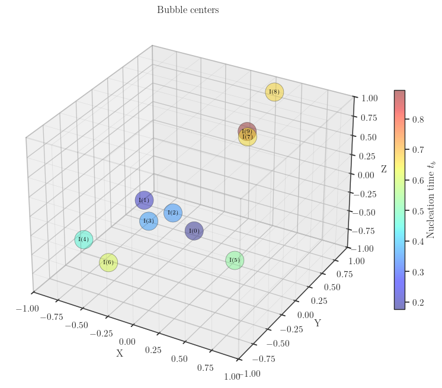
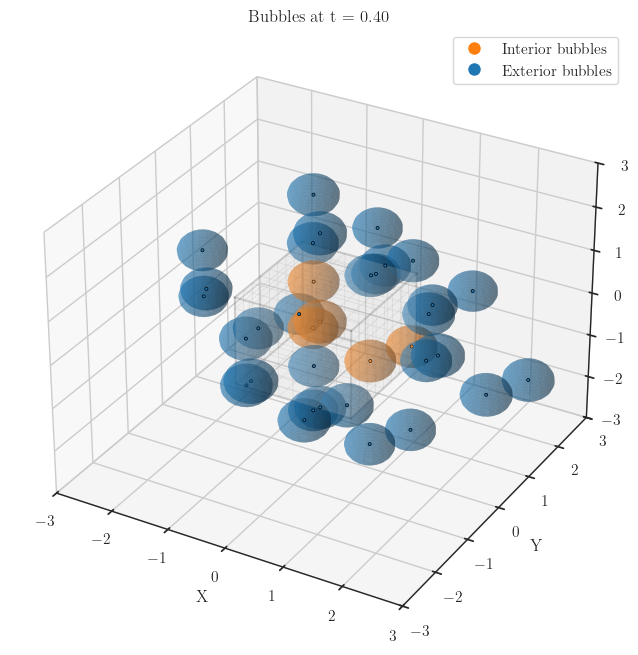
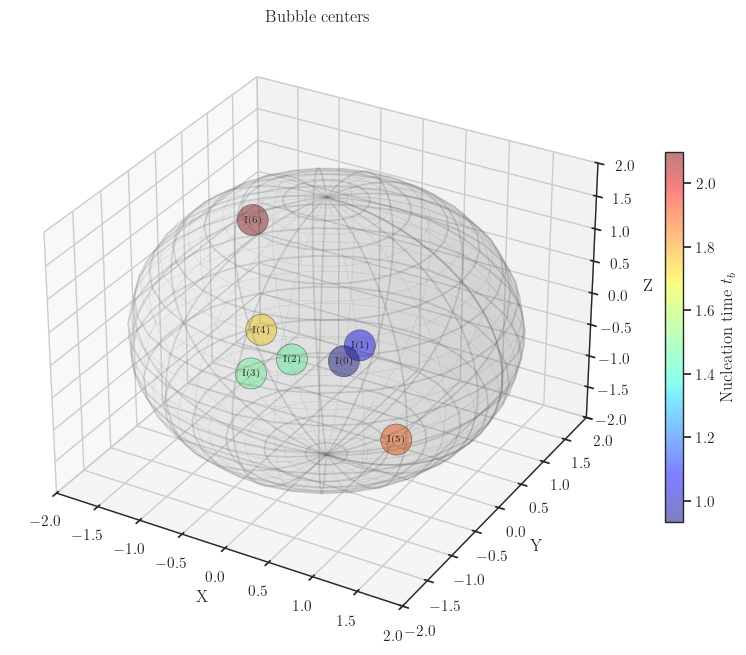
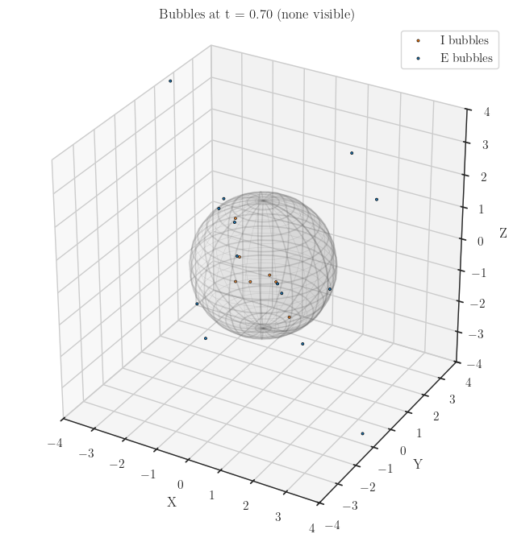

# Bubbles on a Lattice

In order to perform the following checks

+ All *bubbles_interior* in a configuration are inside a defined lattice,
+ All *bubbles_exterior* in a configuration are outside a defined lattice,
+ No bubble in *bubbles_interior* is inside another bubbles in either *bubbles_interior* or *bubbles_exterior*,

we need a construction of `LatticeBubbles` corresponding to a lattice and started to add bubbles (e.g loading from input files) or nucleate bubbles using a nucleation strategy.
The exterior bubbles can be generated if we impose a boundary condition.

The built-in lattices are:

+ `ParallelepipedLattice`, which is initialized with an origin and a basis vectors.
+ `CartesianLattice`: similar construction compared to `ParallelepipedLattice`, but all the basis vectors are required to be orthogonal.
+ `SphericalLattice`: initialized with a center and a radius.

The supported boundary conditions are:

+ `PeriodicBoundaryCondition`, which only apply to `ParallelepipedLattice` and `CartesianLattice`.
+ `ReflectionBoundaryCondition`, which is available for all three built-in lattices.

The supported nucleation strategies are

+ `SpontaneousNucleation`: Nucleate a fixed number of bubbles inside a lattice at the same time.
+ `FixedRateNucleation`: Nucleate the bubbles with a fixed rate $\Gamma$ (i.e fixed number of bubbles in a unit spacetime volume). The nucleation stop if no remaining volume of the lattice is outside all of the bubbles.

Note that in using `FixedNucleationRate` nucleation strategy, we need to know the remaining volume of the lattice that is outside all bubbles available at time $t$ (i.e the false-vacuum valume $V_\text{FV}$).
We therefore need to pass an argument `method`, which currently corresponds to two simple approaches:

+ `method = 'approximation'`: A brute-force approach where $V_\text{FV} = V_\text{lattice} - \sum_n V_n^{\text{(bubbles)}}$. This is fast but does not take into account the bubbles overlapse.
+ `method = 'montecarlo'`: We use Monte-Carlo with uniform sampling, counting number of points are outside all bubbles and take fraction with number of sampling points, multiplied by lattice volume.
This approach is much slower, but we correctly take into account the overlapping bubbles.

## Example code

An example of creating a lattice, attaching with bubbles_interior and do various verifications (bubbles causality, bubbles_interior outside of a given lattice, ...) as well as performing Isometry3 transformations on both the lattice and the bubbles can be found at [lattice_bubbles.py](./examples/lattice_bubbles.py)

### Read bubbles from input file in CartesianLattice

> Distributions of bubble centers

> Bubbles at a given time slice

### Generate bubbles from SphericalLattice

> Distributions of bubble centers

> Bubbles at a given time slice

