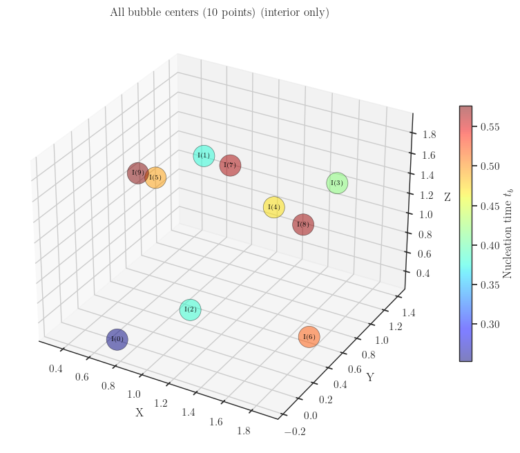
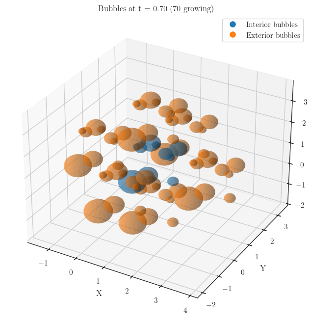

# Bubbles on a Lattice

## Example code

An example of creating a lattice, attaching with bubbles_interior and do various verifications (bubbles causality, bubbles_interior outside of a given lattice, ...) as well as performing Isometry3 transformations on both the lattice and the bubbles can be found at [lattice_bubbles.ipynb](./examples/lattice_bubbles.ipynb)

### Distributions of bubble centers

### Bubbles at a given time slice

