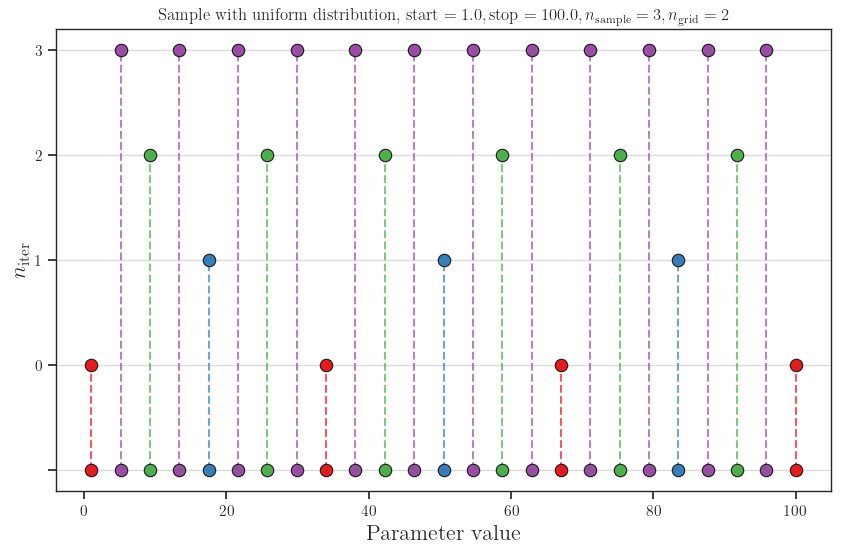
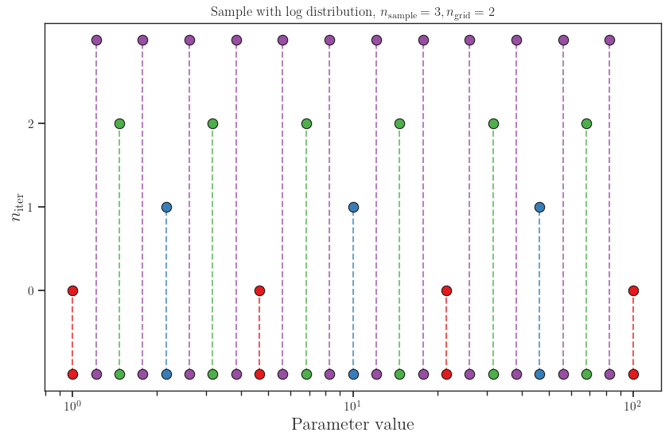

# Adaptive 1D Sampling Utility (`bubble_gw.utils.sample`)

A high-performance adaptive sampling tool for generating hierarchical, non-uniform grids — ideal when evaluating expensive functions with gradually increasing resolution.

- Start with a coarse grid (`n_iter = 0`)
- Each refinement level (`n_iter ≥ 1`) adds **only new points** in between existing ones
- No duplicates → perfect for nested training, multi-fidelity modeling, or progressive sampling

## Parameters

| Parameter       | Meaning                                                                        |
| --------------- | ------------------------------------------------------------------------------ |
| `start`, `stop` | Sampling range (inclusive)                                                     |
| `n_sample`      | Number of **intervals** in the base grid → `n_sample + 1` points at `n_iter=0` |
| `n_grid ≥ 2`    | Refinement factor: how many sub-points per parent interval                     |
| `n_iter`        | Refinement level (`0` = base grid only, `>0` = new points at that level)       |
| `sample_type`   | `"uniform"`, `"linear"`, `"log"`, `"exp"`                                      |
| `base`          | Base for log/exp (default: `10.0`)                                             |

## Basic Examples

```python
from bubble_gw.utils import sample

# Linear spacing (equivalent to np.linspace)
sample(start=1.0, stop=100.0, n_sample=5, n_grid=2, n_iter=0, sample_type="linear")

# Logarithmic spacing (equivalent to np.geomspace with base 10)
sample(start=1.0, stop=100.0, n_sample=5, n_grid=2, n_iter=0, sample_type="log")
# or with a different base
sample(start=1.0, stop=100.0, n_sample=5, n_grid=2, n_iter=0, sample_type="log", base=2.0)
```

To better visualize the usage of this util, run the example [visualize_samples.py](./examples/visualize_samples.py)


