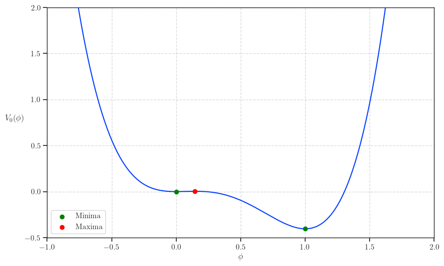
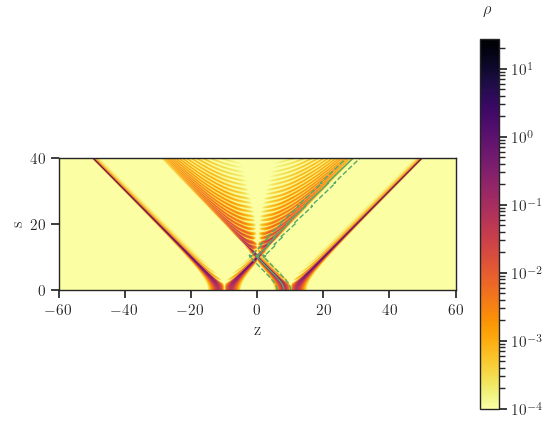
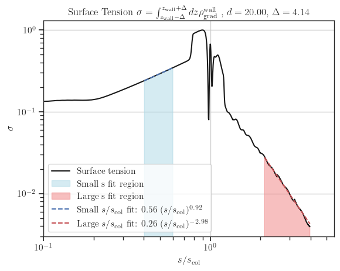

# Example working with two bubbles system

## Physics Background
> More details on the computations can be found at e.g [On bubble collisions in strongly supercooled phase transitions](https://arxiv.org/abs/1912.00997).

The scalar fields $\phi_{\pm}(s, z)$ are solutions to the following PDEs, which describe the dynamics of two colliding bubbles:
$$
\pm \dfrac{\partial^2 \phi_{\pm}}{\partial s^2} \pm \dfrac{2}{s} \dfrac{\partial \phi_{\pm}}{\partial s} - \dfrac{\partial^2 \phi_{\pm}}{\partial z^2} + \dfrac{\partial V}{\partial \phi_{\pm}} = 0
$$

+ $\phi_+(s, z)$ : Represents the field in the region where $t^2 > x^2 + y^2$. This is typically obtained from lattice simulations.
+ $\phi_-(s, z)$ : Represents the field in the region where $t^2 < x^2 + y^2$. It is analytically defined as:
  $$
  \phi_-(t, z) = \phi_0 \left(\sqrt{s^2 + (z - d/2)^2}\right) + \phi_0\left(\sqrt{s^2 + (z + d/2)^2}\right)
  $$
  where $\phi_0$ is the bubble profile, and $d$ is the separation distance between the bubble centers.

In this package, $\phi_+$ is referred to as phi1, and $\phi_-$ as phi2.
The initial condition is the sum of the critical bubbles, which is solved by using the package **CosmoTransitions**.
We can immediately deduce the value of $\phi_-(t, z)$, while $\phi_+(t, z)$ is obtained by solving the PDE on a $(1+1)D$ lattice using leapfrog method.
The GW spectrum is computed by integrating over the field derivatives and weights, accounting for contributions from different spatial components (e.g., (zz), (xx), (yy), and (xz)).

The stress energy elements integral over the coordinates $(s, u, \varphi, z)$ can then be rewritten as follows
$$
    \widetilde{T}_{xx} = \dfrac{1}{2} \int ds \ s^2 \int_{-\infty}^\infty dz \ e^{-i \cos \theta_k \omega z} 
    \quad \times \biggl[
    \left( \partial_s \Phi_+ \right)^2 \int_0^\infty du \ C(su) \left( u^2 - 1 \right) e^{i \omega s u} \left[ J_0\left( \omega \sin \theta_k s \sqrt{u^2 - 1} \right) - J_2\left( \omega \sin \theta_k \sqrt{u^2 - 1} \right) \right] 
    \qquad + \left( \partial_s \Phi_- \right)^2 \int_0^\infty du \ C(su) \left( u^2 + 1 \right) e^{i \omega s u} \left[ J_0\left( \omega \sin \theta_k s \sqrt{u^2 + 1} \right) - J_2\left( \omega \sin \theta_k \sqrt{u^2 + 1} \right) \right]
    \biggr] \\
    \widetilde{T}_{yy} = \dfrac{1}{2} \int ds \ s^2 \int_{-\infty}^\infty dz \ e^{-i \cos \theta_k \omega z} 
    \quad \times \biggl[
    \left( \partial_s \Phi_+ \right)^2 \int_0^\infty du \ C(su) \left( u^2 - 1 \right) e^{i \omega s u} \left[ J_0\left( \omega \sin \theta_k s \sqrt{u^2 - 1} \right) + J_2\left( \omega \sin \theta_k \sqrt{u^2 - 1} \right) \right] 
    \qquad + \left( \partial_s \Phi_- \right)^2 \int_0^\infty du \ C(su) \left( u^2 + 1 \right) e^{i \omega s u} \left[ J_0\left( \omega \sin \theta_k s \sqrt{u^2 + 1} \right) + J_2\left( \omega \sin \theta_k \sqrt{u^2 + 1} \right) \right]
    \biggr] \\[10pt]
    \widetilde{T}_{zz} = \int ds \ s^2 \int_{-\infty}^\infty dz \ e^{-i \cos \theta_k \omega z} 
    \quad \times \biggl[
    \left( \partial_z \Phi_+ \right)^2 \int_0^\infty du \ C(su) e^{i \omega s u} J_0\left( \omega \sin \theta_k s \sqrt{u^2 - 1} \right) 
    \qquad + \left( \partial_z \Phi_- \right)^2 \int_0^\infty du \ C(su) e^{i \omega s u} J_0\left( \omega \sin \theta_k s \sqrt{u^2 + 1} \right)
    \biggr] \\[10pt]
    \widetilde{T}_{xz} = i \int ds \ s^2 \int_{-\infty}^\infty dz \ e^{-i \cos \theta_k \omega z} 
    \quad \times \biggl[
    \left( \partial_s \Phi_+ \partial_z \Phi_+ \right) \int_0^\infty du \ C(su) \sqrt{u^2 - 1} e^{i \omega s u} J_1\left( \omega \sin \theta_k s \sqrt{u^2 - 1} \right) 
    \qquad - \left( \partial_s \Phi_- \partial_z \Phi_- \right) \int_0^\infty du \ C(su) \sqrt{u^2 + 1} e^{i \omega s u} J_1\left( \omega \sin \theta_k s \sqrt{u^2 + 1} \right)
    \biggr],
$$
with $C(t)$ being the time cut-off function.
Furthermore, with the choice $\hat{\bm{k}} = (\sin\theta_k, 0, \cos\theta_k)$, the projector $P_{ij}(\hat{\bm{k}}) = \delta_{ij} - \hat{\bm{k}}_i \hat{\bm{k}}_j$ reduces to
$$
    P(\hat{\bm{k}}) 
    = \begin{pmatrix}
        \cos^2 \theta_k & 0 & - \sin \theta_k \cos \theta_k \\
        0 & 1 & 0 \\
        - \sin \theta_k \cos \theta_k & 0 & \sin^2 \theta_k
    \end{pmatrix},
$$
and therefore the energy radiated gravitationally in the direction $\hat{\bm{k}}$ reads
$$
    \dfrac{d E_{\rm GW}(\hat{\bm{k}}, \omega)}{d \omega d \Omega}
    = 2 G \omega^2 \left( \mathrm{Tr}\left[ P \widetilde{T}^\ast P \widetilde{T} \right] - \dfrac{1}{2} \biggl\vert \mathrm{Tr}\left[ P \widetilde{T} \right] \biggr\vert^2 \right) \nonumber \\
    = G \omega^2 \biggl\vert \cos^2 \theta_k \widetilde{T}_{xx} - \widetilde{T}_{yy} + \sin^2 \theta_k \widetilde{T}_{zz} - \sin (2 \theta_k) \widetilde{T}_{xz} \biggr\vert^2.
$$

## Example of computing GW spectrum in 2 bubbles set-up

Here we consider the quartic potential
$$
V(\phi) = \dfrac{m^2}{2} \phi^2 - \dfrac{\delta}{3} \phi^3 + \dfrac{\lambda}{4} \phi^4.
$$
Define $\overline{\lambda}=\dfrac{9 \lambda m^2}{2 \delta^2}$, the range for a first order phase transition to happen is $\overline{\lambda} \in (0, 1)$.
The chosen parameters in the following results are
$$
\overline{\lambda} = 0.84, \quad
m = 1, \quad
\delta = \dfrac{\sqrt{9 - 8 \overline{\lambda}} + 3}{4 \overline{\lambda}}, \quad
\lambda = \dfrac{(\sqrt{9 - 8 \overline{\lambda}} - 3)^2}{8 \overline{\lambda}},
$$
A sketch of the potential in this example is shown below.

One can solve for the bubble profile using e.g CosmoTransitions.
This profile can be use to build the initial condition for the lattice simulation with 2 bubbles nucleated at the same time and has a separation $d$.

## Example code

An example of working with two bubbles system can be found at [two_bubbles.py](./examples/two_bubbles.py).

### Evolution of field profile

### Evolution of gradient energy density

### Surface tension of the wall as a function of time

Below is the surface tension which increases linearly for $s \leq s_\text{col}$ and decreases after bubble collision.
Part of the surface energy stored in the wall get dissipated as plane-waves during the collision phase.

### GW spectrum of two bubbles collision

Below is the GW spectrum computed with the input being field evolution.
Note that the oscillations at high frequency is not physical, but from the fact that we have finite space and time resolution. 
By increasing the lattice resolution (i.e reducing space and time step sizes), these oscillations get smoothed out.

