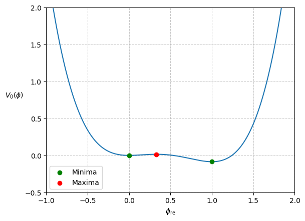
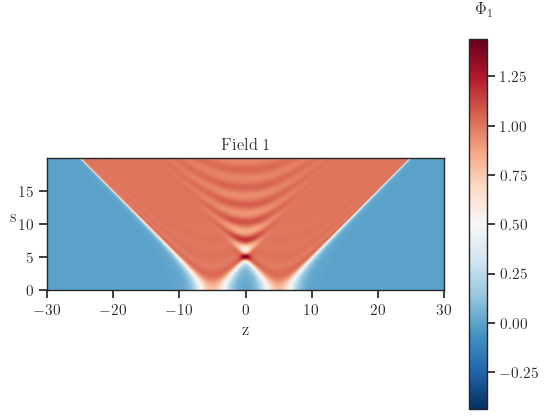
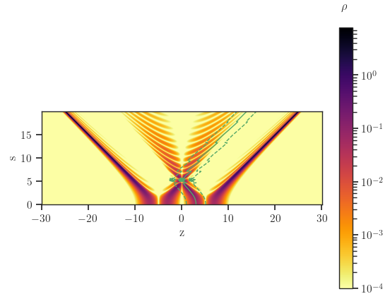
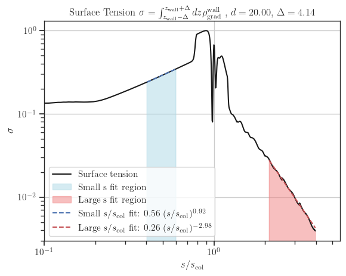
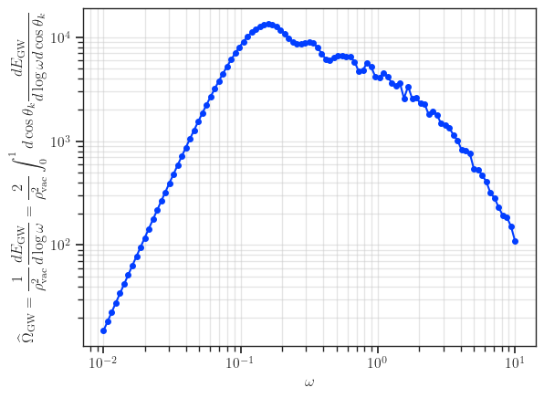

# Example of computing GW spectrum in 2 bubbles set-up

Here we consider the quartic potential
$$
V(\phi) = \dfrac{m^2}{2} \phi^2 - \dfrac{\delta}{3} \phi^3 + \dfrac{\lambda}{4} \phi^4.
$$
Define $\overline{\lambda}=\dfrac{9 \lambda m^2}{2 \delta^2}$, the range for a first order phase transition to happen is $\overline{\lambda} \in (0, 1)$.
The chosen parameters in the following results are
$$
\overline{\lambda} = 0.84, \quad
m = 1, \quad
\delta = \dfrac{\sqrt{9 - 8 \overline{\lambda}} + 3}{4 \overline{\lambda}}, \quad
\lambda = \dfrac{(\sqrt{9 - 8 \overline{\lambda}} - 3)^2}{8 \overline{\lambda}},
$$
A sketch of the potential in this example is shown below.

One can solve for the bubble profile using e.g CosmoTransitions.
This profile can be use to build the initial condition for the lattice simulation with 2 bubbles nucleated at the same time and has a separation $d$.

## Evolution of field profile

## Evolution of gradient energy density

## Surface tension of the wall as a function of time

## GW spectrum of two bubbles collision

Below is the GW spectrum computed with the input being field evolution

